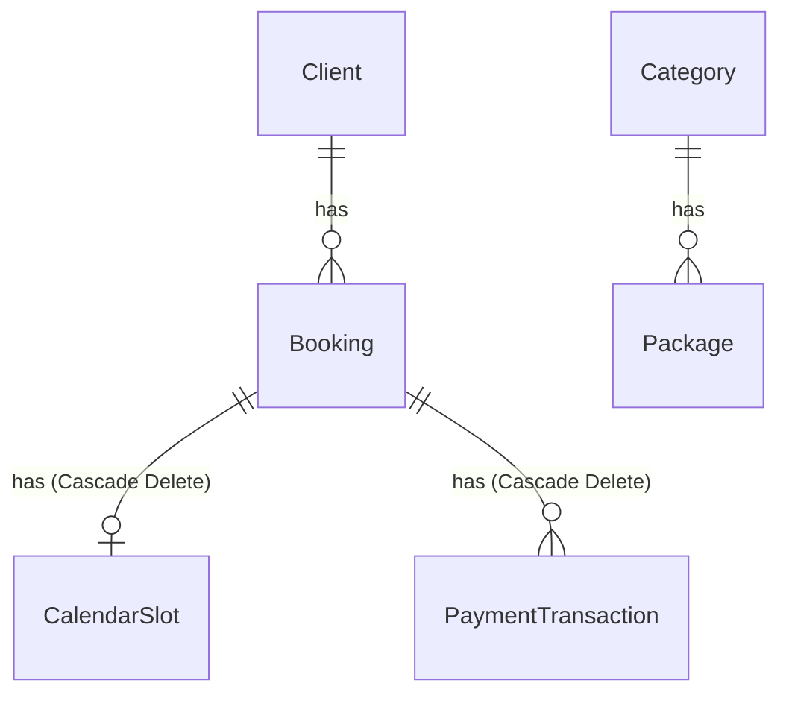

# Seniman Kamera — Developer & AI Agent Guide

> Platform manajemen studio fotografi profesional yang menggabungkan portofolio publik, sistem booking klien, dan panel admin terintegrasi. 
> Dokumen ini dirancang sebagai panduan lengkap untuk agen AI dan developer agar dapat memahami arsitektur, skema basis data, alur bisnis, dan aturan teknis proyek dengan cepat.

---

## 📌 Deskripsi Singkat & Fitur Utama

**Seniman Kamera** adalah aplikasi web full-stack untuk studio fotografi bergaya editorial. Memiliki dua sisi utama:
1. **Sisi Publik** — Halaman beranda (landing page), portofolio galeri kategori, paket layanan, dan wizard form booking klien (5 langkah interaktif).
2. **Sisi Admin** — Dashboard analitik (revenue, statistik booking), manajemen pemesanan (approval, reject, reschedule), kalender jadwal visual, manajemen portofolio (upload media, drag-and-drop reorder), manajemen paket & kategori, dan pengaturan Syarat & Ketentuan.

---

## 🛠️ Tech Stack & Dependencies

* **Framework**: Next.js 16.2.9 (App Router)
* **Runtime**: Node.js 18+ (Dihosting di Vercel)
* **Styling**: Tailwind CSS v4.0.0
* **Database & ORM**: PostgreSQL (Supabase) + Prisma 7.8.0
* **Autentikasi**: Supabase Auth (`@supabase/ssr` middleware)
* **Pembayaran**: Midtrans Snap SDK (Pop-up modal integrasi JavaScript client-side)
* **Notifikasi**: Telegram Bot API (Pengiriman status booking via HTTP client)
* **Drag & Drop**: `@dnd-kit/core` + `@dnd-kit/sortable` (Digunakan untuk mengurutkan galeri secara visual)
* **Komponen Tabel & Chart**: TanStack Table v8 & Recharts
* **Validasi Skema**: Zod v4 (Validasi form input klien & admin)

---

## 📂 Struktur Direktori Utama

```
senimankamera/
├── app/                        # Next.js App Router (Halaman & Layout)
│   ├── (public)/               # Route group halaman publik (Landing Page, Portfolio, Book, dll.)
│   ├── admin/                  # Route group panel admin (Terproteksi Middleware Auth)
│   │   ├── bookings/           # Daftar booking aktif & persetujuan
│   │   ├── calendar/           # Kalender jadwal visual
│   │   ├── history/            # Halaman riwayat booking (Lunas / Rejected)
│   │   └── recap/              # Rekap & ekspor Excel (.xlsx)
│   ├── login/                  # Halaman login admin
│   ├── layout.tsx              # Root Layout
│   └── globals.css             # Konfigurasi Tailwind v4
│
├── src/
│   ├── modules/                # Domain-Driven Feature Modules
│   │   ├── auth/               # Logika autentikasi admin
│   │   ├── booking/            # Domain pemesanan (form, repository, actions)
│   │   ├── calendar/           # Domain kalender & pemblokiran jadwal manual
│   │   └── gallery/            # Domain galeri foto/video & testimoni
│   └── infrastructure/         # Integrasi eksternal & helper backend
│       ├── prisma/             # Instance prisma client dengan adapter-pg
│       ├── supabase/           # Middleware & Client initialization
│       ├── midtrans/           # Midtrans Snap API Service
│       └── telegram/           # Pengiriman notifikasi Telegram Bot
│
├── components/                 # Shared UI Components (shadcn/ui & custom)
├── prisma/
│   ├── schema.prisma           # Skema database Postgres
│   └── seed.ts                 # Script seeding data awal
└── scratch/                    # Temporary scratch scripts (Uji coba koneksi, webhook, dll.)
```

---

## 🏗️ Pola Arsitektur Modul (`src/modules/`)

Setiap modul fitur di dalam `src/modules/` menerapkan pola **Layered Domain Architecture** untuk memisahkan tanggung jawab (Separation of Concerns):

1. **`actions/`** (Server Actions): Entry point dari UI klien. Menggunakan arahan `"use server"`. Mengambil input, memproses otentikasi/headers, instansiasi repository, dan memanggil Use Cases.
2. **`use-cases/`** (Business Logic): Mengandung logika bisnis murni. Melakukan orkestrasi validasi skema (Zod), verifikasi tumpang tindih jadwal, pembuatan transaksi Midtrans, dan pemanggilan repositori.
3. **`repositories/`** (Database Access): Mengandung query database langsung menggunakan Prisma. Bertanggung jawab atas operasi CRUD, transaksi, dan agregasi data.
4. **`schemas/`**: Mengandung skema validasi Zod untuk input data.
5. **`components/`**: Komponen React yang spesifik hanya digunakan oleh modul tersebut.

---

## 🗄️ Relasi Skema Database (Prisma)

Berikut adalah ringkasan penting relasi model di [schema.prisma](file:///d:/Project/seniman%20kamera/senimankamera/prisma/schema.prisma):



### Karakteristik Model:
* **`Booking`**: Menampung status booking (`PENDING`, `APPROVED`, `LUNAS`, `CANCELLED`, `ManualBooking`). Terhubung ke `Client` melalui `clientId`.
* **`CalendarSlot`**: Model unik berdasarkan tanggal (`date DateTime @unique`). Berfungsi untuk memblokir tanggal secara penuh di kalender. Jika terhubung dengan `bookingId`, penghapusan `Booking` akan memicu **`onDelete: Cascade`** pada `CalendarSlot`.
* **`PaymentTransaction`**: Catatan riwayat pembayaran. Terbagi menjadi tipe `DP` atau `FULL`. Memiliki unique key `{bookingId}-DP` atau `{bookingId}-FULL`. Menghapus booking akan memicu **`onDelete: Cascade`** pada riwayat pembayaran ini.

---

## 🔄 Aturan Logika Bisnis & Alur Kerja Utama

### 1. Kategori Pemesanan: `DATE_ONLY` vs `TIME_BASED`
Sistem booking memiliki dua perilaku berdasarkan tipe pemesanan kategori layanan (`Category.bookingType`):

* **`DATE_ONLY` (Pemesanan Harian)**:
  * Digunakan untuk paket besar seperti *Wedding* atau *Prewedding*.
  * Ketika dipesan, seluruh tanggal tersebut akan langsung diblokir di kalender. 
  * Repositori menggunakan `isDateBooked(date)` untuk memeriksa keberadaan `CalendarSlot` aktif pada hari tersebut.
  * Pembuatan booking baru akan membuat `CalendarSlot` yang terhubung langsung dengan `bookingId`.

* **`TIME_BASED` (Pemesanan Sesi Jam)**:
  * Digunakan untuk sesi studio foto dengan durasi sesi (`Package.sessionDuration` dalam menit).
  * Hari tersebut tidak otomatis terblokir penuh kecuali admin secara manual memblokirnya (`ManualBlock`) atau ada pemesanan `DATE_ONLY`.
  * Hari tersebut ditandai dengan status `TIME_BASED_ACTIVE` di `CalendarSlot` (dengan `bookingId: null`) untuk menandai adanya sesi aktif di hari itu.
  * Tumpang tindih jadwal diperiksa menggunakan `isTimeSlotOverlapping(date, startTime, endTime, excludeBookingId)` dengan toleransi buffer transisi antar sesi sebesar **15 menit**.

---

### 2. Status Transaksi & Workflow Pembayaran

```
[Pemesanan Klien] -> Status: PENDING (Belum terbit pembayaran)
        │
  [Admin Approve] -> Status: APPROVED & Terbit Invoice DP (20% atau flat Rp150.000)
        │
  [Bayar DP (Midtrans)] -> Status: APPROVED (Tercatat PaymentTransaction tipe DP)
        │
  [Admin Menandai Lunas] -> Status: LUNAS (Tercatat PaymentTransaction tipe FULL)
```

* **Booking Baru**: Masuk dengan status `PENDING`. Jika booking bertipe `DATE_ONLY`, slot kalender langsung terkunci sebagai `PENDING`. Jika bertipe `TIME_BASED`, slot ditandai `TIME_BASED_ACTIVE`.
* **Reschedule**: Admin dapat menjadwal ulang booking melalui halaman admin. Proses ini akan otomatis memperbarui tanggal booking dan memindahkan slot kalender ke tanggal baru, serta menghapus slot lama jika sudah tidak ada sesi aktif tersisa.

---

### 3. Solusi Loophole Pembayaran & Celah Pemesanan (Issue #7 Fixes)

Untuk mencegah pengguna memblokir slot kalender secara permanen tanpa membayar (karena status `PENDING` dianggap memblokir tanggal di repositori), sistem menerapkan mekanisme berikut:

1. **Midtrans Connection Failure Handling**:
   * Di dalam [create-booking.use-case.ts](file:///d:/Project/seniman%20kamera/senimankamera/src/modules/booking/use-cases/create-booking.use-case.ts), jika API Midtrans gagal membuat token transaksi Snap, sistem akan langsung melempar error (`throw new Error`). Penulisan data booking ke database dibatalkan sepenuhnya untuk menghindari sampah entri `PENDING` tanpa token pembayaran.
2. **Auto-Cancellation Sisi Klien**:
   * Di dalam [booking-form.tsx](file:///d:/Project/seniman%20kamera/senimankamera/src/modules/booking/components/booking-form.tsx), callback `onClose` (pop-up pembayaran ditutup sengaja) dan `onError` (pembayaran ditolak/gagal) pada SDK Midtrans Snap akan langsung memicu pemanggilan server action `cancelPendingBookingAction(bookingId)`.
   * Logika ini menghapus entri booking `PENDING` di database secara instan untuk melepaskan slot kalender.
   * State formulir (React states) tetap dipertahankan, sehingga pengguna dapat langsung mengeklik ulang tombol konfirmasi untuk mencoba kembali dengan metode pembayaran lain.
3. **Pembersihan Otomatis Slot Yatim (Orphaned Slots)**:
   * Di dalam [booking.repository.ts](file:///d:/Project/seniman%20kamera/senimankamera/src/modules/booking/repositories/booking.repository.ts), helper `cleanupOrphanedTimeBasedSlots` akan memindai apakah masih ada booking aktif pada hari tersebut. Jika tidak ada lagi booking aktif yang tersisa setelah penghapusan (misal semua dibatalkan/dihapus), `CalendarSlot` bertipe `TIME_BASED_ACTIVE` pada tanggal tersebut akan dihapus secara transaksional di database untuk membebaskan tanggal tersebut sepenuhnya bagi kategori `DATE_ONLY`.

---

## 💾 Upload File & Media Portofolio

* **Client-Side Upload ke Supabase**: Untuk menghindari masalah limit ukuran payload transfer di Next.js server actions, media portofolio diunggah secara langsung dari browser klien ke Supabase Storage Bucket (`gallery` atau `packages`) via Supabase Browser Client SDK.
* **Metadata Save**: Setelah upload ke storage sukses, klien mengirim URL publik dan path penyimpanan ke Server Action (`uploadMediaAction` atau `package-admin.action.ts`) untuk mencatat metadata ke database Postgres.
* **Drag-and-Drop Reordering**: Admin dapat mengurutkan gambar portofolio secara visual di halaman `/admin/galleries`. Urutan baru dikirim ke database untuk memperbarui indeks penampilan galeri.

---

## 🔐 Autentikasi & Proteksi Sesi

* **Middleware**: Sesi masuk admin diproteksi oleh file middleware `middleware.ts` menggunakan `@supabase/ssr` (method `updateSession`).
* **Session Timeout Component**: Komponen global `SessionTimeout` memantau aktivitas mouse/keyboard admin. Jika tidak ada aktivitas setelah jangka waktu tertentu (default 30 menit), sesi admin akan otomatis di-logout dan diarahkan kembali ke `/login` untuk aspek keamanan data.

---

## 🤖 Panduan Penting untuk Agen AI & Developer

Jika Anda diminta untuk memodifikasi atau menambahkan fitur baru ke proyek ini, perhatikan aturan-aturan wajib berikut:

1. **Selalu Gunakan Prisma Transaction**: Saat melakukan insert/update data yang memiliki relasi berantai (seperti `Booking` -> `CalendarSlot`), pastikan untuk membungkus operasi database dalam `prisma.$transaction(async (tx) => { ... })` agar data tetap konsisten.
2. **Pertahankan Validasi Zod**: Selalu lakukan validasi Zod schema baik di sisi client (form) maupun di server (use case) sebelum memproses input apa pun.
3. **Jangan Menyimpan Token Kunci (Secret) di Kode**: Semua konfigurasi (kunci API Midtrans, token Telegram, kredensial DB) harus selalu dibaca melalui `process.env`.
4. **Verifikasi Build & TypeScript**: Sebelum melakukan commit atau serah terima tugas, selalu jalankan dua perintah berikut untuk memastikan tidak ada jenis error compile:
   ```bash
   npx tsc --noEmit
   npm run build
   ```
5. **Tailwind CSS v4 Utility**: Gaya tampilan menggunakan Tailwind v4. Hindari membuat inline style kustom baru kecuali sangat mendesak; manfaatkan sistem kelas utility bawaan atau modifikasi konfigurasi di stylesheet global [globals.css](file:///d:/Project/seniman%20kamera/senimankamera/app/globals.css) jika diperlukan.
